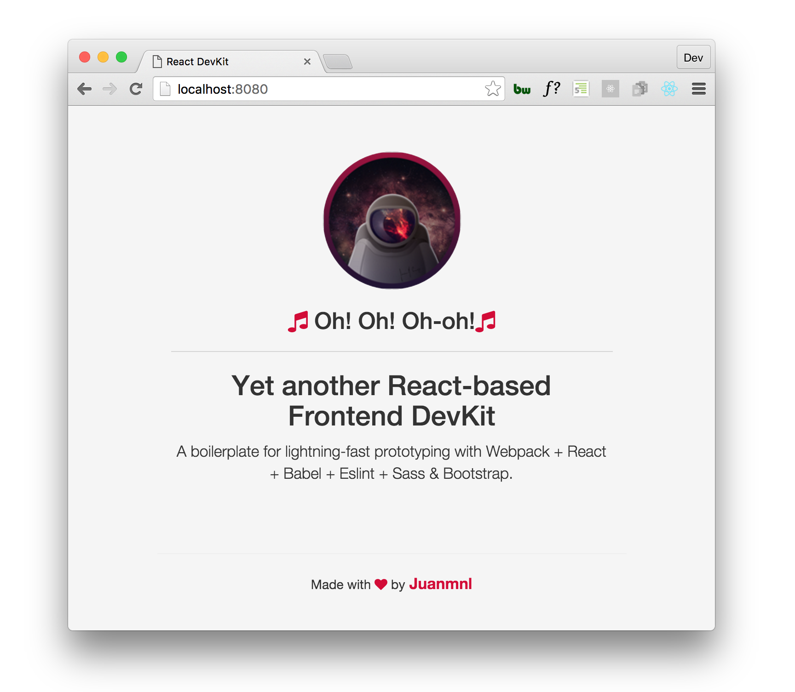

# React Starter DevKit
[](https://travis-ci.org/juanmnl/react-starter)
[](https://david-dm.org/juanmnl/react-starter)
[](https://codeclimate.com/github/juanmnl/react-starter)


**A small boilerplate for lightning-fast prototyping :rocket: :moon:**



### Featuring:
* NPM
* Webpack
* React
* Scss (-> PostCss)
* Bootstrap
* Babel
* Eslint

#### Extras:
* React-HMR
* React-router & History
* Font-awesome

---

### Install

Clone or download the react-starter project.

***FROM ROOT FOLDER***

**Install dependencies**
```
npm install
```

**Run dev server** *`http://localhost:8080/webpack-dev-server/`*
```
npm start
```  

**Build project**
```
npm run build
```

---
### Config File Quick Tips  

You can add an array of files to the entry *(files that are not required anywhere else)* :

```
entry: [ "./otherFile", "./app/app.js"]
```  

If you need some kind of preloading like *jshint*, you can add a .jshintrc to your root folder (for configuration), the jshint-loader to package.json and 'preloaders' into the modules:  
```
preloaders: [
  {
    test: /\.js/,
    exclude: /node_modules/,
    loader: "jshint-loader"
  }
]
```

Webpack resolves every .js file but if you want to use different extensions, you can set this after the *modules*:  
```
resolve: {
  extensions: ['', '.js', '.es6', '.ejs', .. ]
}
```
